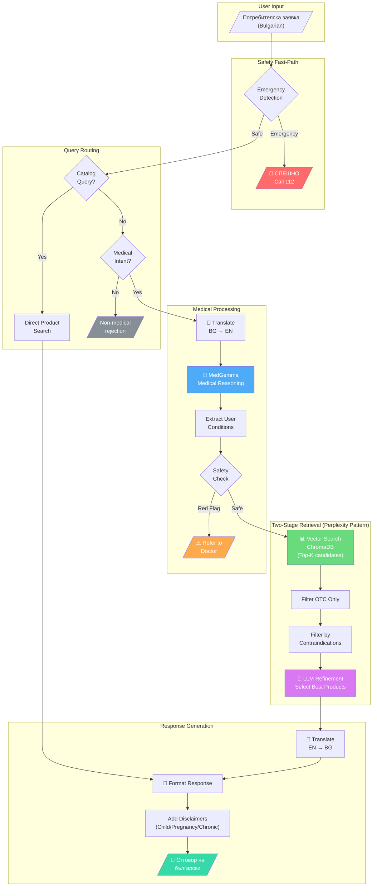
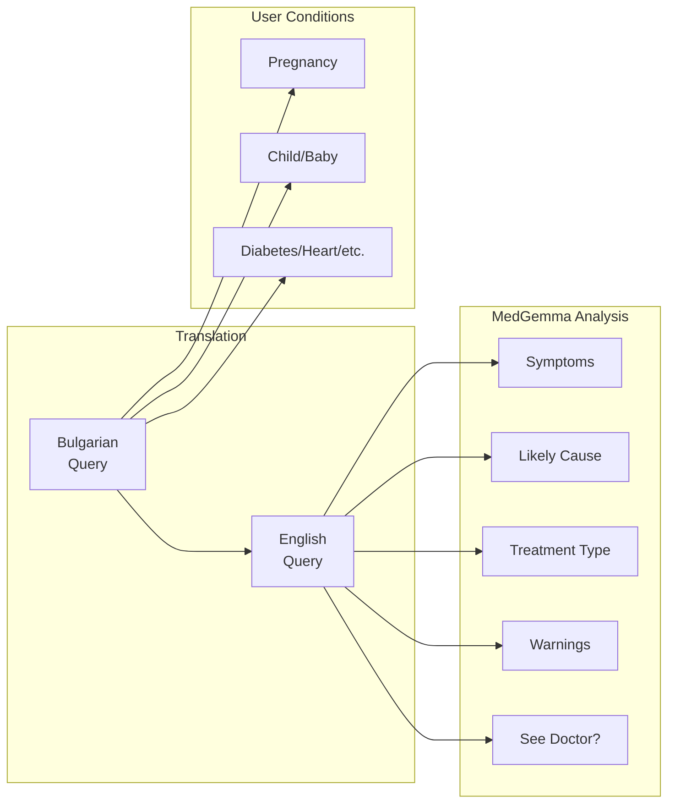
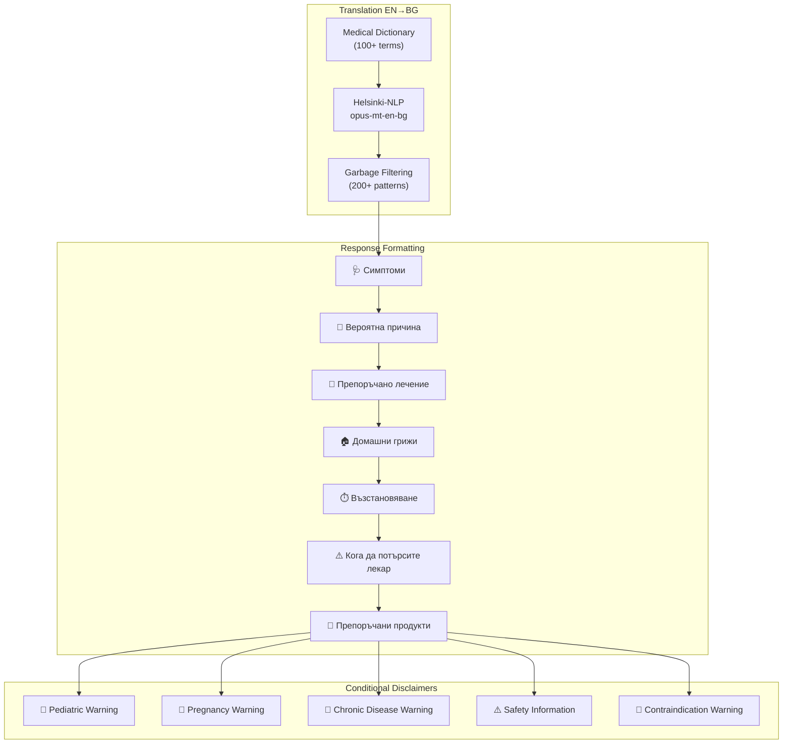

# ViaPharma Chatbot Pipeline

## Architecture Overview



## Component Details

### 1. Safety Fast-Path
- **Hard-coded keyword matching** for emergency symptoms
- Runs FIRST on every query (non-negotiable)
- Triggers: chest pain, can't breathe, suicide, poisoning, etc.
- Response: Immediate 112 emergency referral

### 2. Query Routing

#### Catalog Query Detection
Bypasses medical reasoning for product-only queries:
- "Какви марки слънцезащитни имате?"
- "Покажи ми витамини"
- "Търся крем за лице"

#### Intent Classification
- Rule-based + pattern matching
- Rejects non-pharmacy queries (delivery, payment, etc.)

### 3. Medical Processing



### 4. Two-Stage Retrieval (Perplexity Pattern)

| Stage | Component | Purpose | Speed |
|-------|-----------|---------|-------|
| 1 | ChromaDB Vector Search | Get top-K candidates | ~50ms |
| 1b | OTC Filter | Remove prescription drugs | ~1ms |
| 1c | Contraindication Filter | Remove unsafe products | ~10ms |
| 2 | LLM Refinement | Pick best 2-3 matches | ~2-3s |

### 5. Response Generation



## Data Flow Summary

```
User Query (BG)
    ↓
[Emergency Check] → 🚨 Emergency Response
    ↓
[Catalog Check] → 🛒 Direct Product Listing
    ↓
[Intent Check] → ❌ Non-medical Rejection
    ↓
[Translate BG→EN]
    ↓
[MedGemma Reasoning]
    ↓
[Safety Check] → ⚠️ Doctor Referral
    ↓
[ChromaDB Search] → Top 10 candidates
    ↓
[OTC + Contraindication Filter] → Safe products
    ↓
[LLM Refinement] → Best 2-3 products
    ↓
[Translate EN→BG]
    ↓
[Format + Disclaimers]
    ↓
Final Response (BG)
```

## Key Files

| File | Purpose |
|------|---------|
| `src/pipeline/orchestrator.py` | Main pipeline orchestrator |
| `src/pipeline/models.py` | Data models (Product, PipelineResult) |
| `src/pipeline/constants.py` | Symptom mappings, keywords |
| `src/pipeline/conditions.py` | User condition extraction |
| `src/pipeline/product_ingredients.py` | Ingredient parsing |
| `src/pipeline/query_router.py` | Query routing logic |
| `src/medical_model.py` | MedGemma integration |
| `src/translator.py` | BG↔EN translation |
| `src/product_store.py` | ChromaDB vector store |
| `src/safety.py` | Emergency/red-flag detection |
| `src/intent_classifier.py` | Medical intent detection |
| `src/unified_processor.py` | Unified LLM processor |

## Performance Metrics

| Query Type | Avg Response Time |
|------------|-------------------|
| Non-medical (rejected) | 2-3ms |
| Catalog query | 50-200ms |
| Medical query | 5-15s |
| Emergency detection | 1-2ms |
